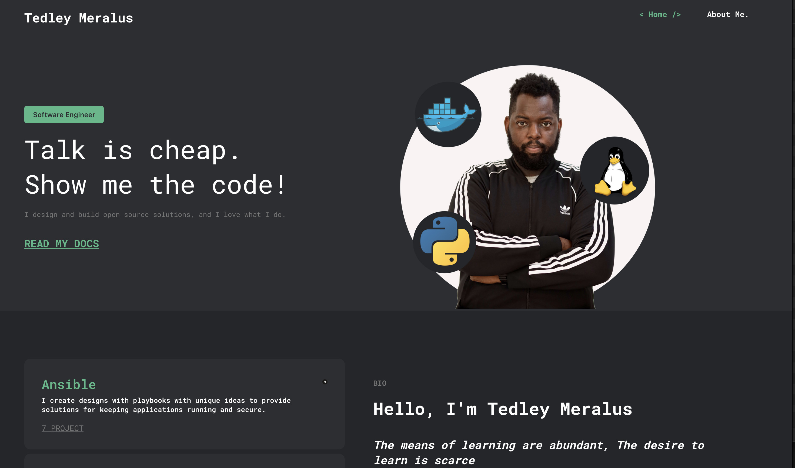

# Developer Portfolio 

* src/components/Header.js - Update image and tagline
* src/components/About.js - Update Image Links
* src/components/Footer.js - Update Social Media Handles



 This project was bootstrapped with [Create React App](https://github.com/facebook/create-react-app).


## Deploy on github 
then run the following commands
```
 $ npm i 
 $ npm run build 
 $ npm run deploy
```

## Available Scripts

In the project directory, you can run:

---
### `npm start`
### `npm test` 
### `npm run build` 
### `npm run eject`
 